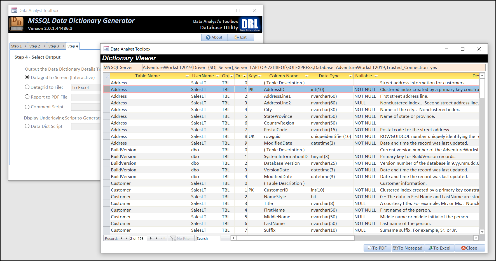

# Data Dictionary Generator

#### Part of the "Data Analysts' Toolbox"

## Overview
* **What**: A free, simple utility for generating data dictionaries as CSV, Excel, or PDF files.  Bonus: generates comment scripts and data dictionary scripts for you to modify and run as needed. 
* **Levelset**: A "Data Dictionary" is simply a list of tables and views, their column properties such as name, ordinal position, data type/length/size/precision, allows nulls, and of course the column description. A good data dictionary also indicates which columns are a part of a primary key, foreign key, or unique key. 
* **Why**: Data dictionaries can be used to train new employees how your system is setup. They can be used as a baseline for new projects, an "as-built" set of documentation from which to start. They can be used as close-out documentation to wrap-up a project and push it out into Excel on a wiki or Sharepoint, etc. 
* **How**: Download and run .accde file.  From there, click open and follow the Wizard steps to run the job against a SQL Server database of your choic.  The appropriate output you selected will popup in Notepad, or Excel, or Acrobat Reader. 
* **Who**: Built as a standalone tool for individual data analysts, systems analysts, ,software test engineers, or similar folks. 
* **Where**: On a desktop or laptop.  **Requires Microsoft Access 365**.  Yep, it is a VBA application, [read here for why](https://github.com/DataResearchLabs/my_task_time_tracker/blob/main/src/SOURCE_CODE.md#whyMicrosoftAccess) 
* **License**: Creative Commons Zero, effectively public domain.  Free to use.  Free to copy.  Free to alter.  Free to distribute. 

## Screenshot
<kbd>
  
</kbd>

***If you like this tool, be sure to click the "Star" button above in GitHub.***  
 
***Also, be sure to visit or subscribe to our YouTube channel*** www.DataResearchLabs.com! 
 

## Downloads & Tutorials by Platform
Links to the application executables, source code, and video tutorials are listed below, by platform (MSSQL, Oracle, MySQL, and Postgresql):
 
 

<table>

<tr>
<td align="center" valign="top">
   
  
</td>
<td>

## MS SQL Server
* [MSSQL "Data Dictionary" Download](https://github.com/DataResearchLabs/data_analysts_toolbox/blob/main/data_dictionary_generator/mssql/download/mssql_data_dict_gen.accde) 
* [MSSQL "Data Dictionary" Source](https://github.com/DataResearchLabs/data_analysts_toolbox/blob/main/data_dictionary_generator/mssql/src/mssql_data_dict_gen.accdb) 
</td>
<td>
<kbd>
<a href="http://www.youtube.com/watch?feature=player_embedded&v=Y6ZUdLBOufY" target="_blank">
   
  
</a>
</kbd>
</td>
</tr>

<tr>
<td align="center" valign="top">
   
  
</td>
<td>

## MySQL
* MySQL "Data Dictionary" Download - Coming Soon 
* MySQL "Data Dictionary" Source - Coming Soon 
</td>
<td>
<kbd>

</kbd>
</td>
</tr>

<tr>
  <td align="center" valign="top">
   
  
</td>
<td>
    
    
## Oracle
* Oracle "Data Dictionary" Download - Coming Soon 
* Oracle "Data Dictionary" Source - Coming Soon 
</td>
<td>
<kbd>

</kbd>
</td>
</tr>

<tr>
<td align="center" valign="top">
   
  
</td>
<td>
    
    
## PostgreSQL
* PostgreSQL "Data Dictionary" Download - Coming Soon 
* PostgreSQL "Data Dictionary" Source - Coming Soon 
</td>
<td>
<kbd>

</kbd>
</td>
</tr>
</table>

 
 
