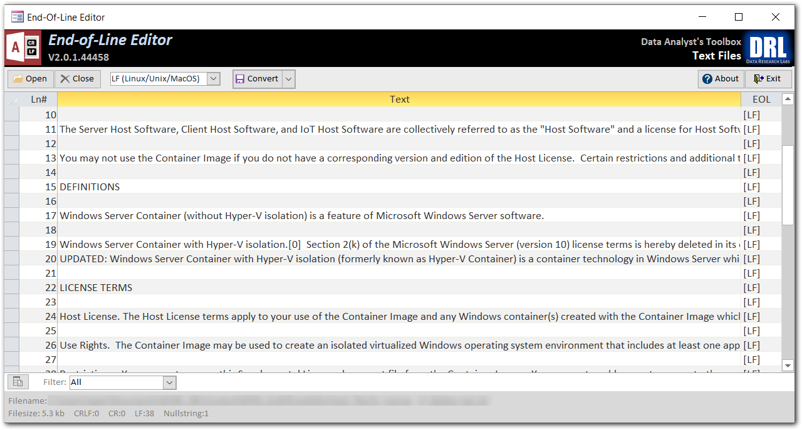

# End-of-Line Editor (EOLE)

#### Part of the "Data Analysts' Toolbox"

## Overview
* **What**: A free, simple utility for identifying and changing end-of-line characters in text files. 
* **Levelset**: Windows PC files end lines with CR+LF (carriage return + line feed).  Linux, Unix, and the newer MAC end lines with just LF.  The older MacOS ended lines with CR.  Text editors and applications in the various operating systems often cannot read files written in another OS until you change the end of line characters. 
* **Why**: Sometimes you need to convert a text file created in Linux (LF terminator) into a file PCs can read (CR+LF terminator).  Same for the reverse direction, or going to or from the old MacOS.  On rare occasions, you'll even see files that for whatever reason mix and match end of line terminators (eg: all CRLF's with one line having only a CR).  You can use this simple utility to quickly spot these issues, and fix them. 
* **How**: Download and run .accdb file.  From there, click open and pick the text file of interest and wait for it to load and parse out.  It will popup with a row count as well as a count of each end-of-line terminator encountered.  Select the new end-of-line you want from the drop-down, and click the convert button. 
* **Who**: Built as a standalone tool for individual data analysts, software test engineers, or similar folks. 
* **Where**: On a desktop or laptop.  **Requires Microsoft Access 365**.  Yep, it is a VBA application, [read here for why](https://github.com/DataResearchLabs/my_task_time_tracker/blob/main/src/SOURCE_CODE.md#whyMicrosoftAccess) 
* **License**: Creative Commons Zero, effectively public domain.  Free to use.  Free to copy.  Free to alter.  Free to distribute. 

## Download
Click here to **[download the application](https://github.com/DataResearchLabs/data_analysts_toolbox/tree/main/text_files_end_of_line_editor/download)**.  This package contains an .accde file that is locked so source code is inaccessible and can be safely used in your organization.  

Click here to **[download the source code](https://github.com/DataResearchLabs/data_analysts_toolbox/blob/main/text_files_end_of_line_editor/src/eol_editor.accdb)**.  This is an .accdb file that is open-source. Either (a) close all forms and press F11, **OR** (b) hold down the Shift-key when you open the application to access ALL source code.

***If you like this tool, be sure to click the "Star" button above in GitHub.***  
 
***Also, be sure to visit or subscribe to our YouTube channel*** www.DataResearchLabs.com! 
 

## Training Videos
<table><tr>
<td>
  
 ***Video #1 "Overview Tutorial"*** 
  <kbd>
  
  </kbd>
</td>
<td>
  
 ***Video #2 "Download & Deploy"*** 
  <kbd>
  
  </kbd>
</td>
 </tr></table> 
 
 

## Screenshot
<kbd>
  
</kbd>

